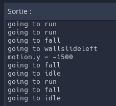
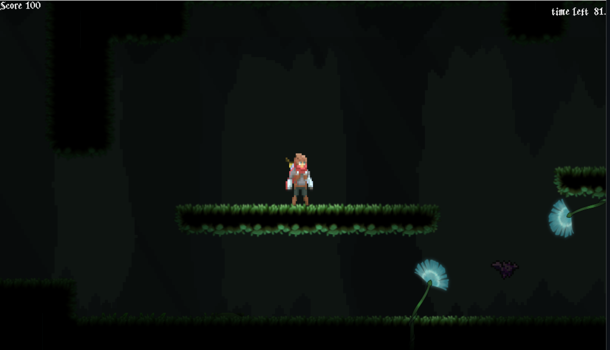
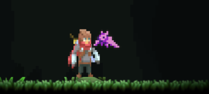
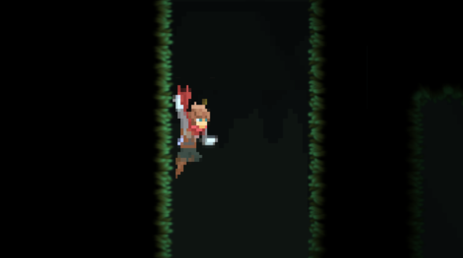
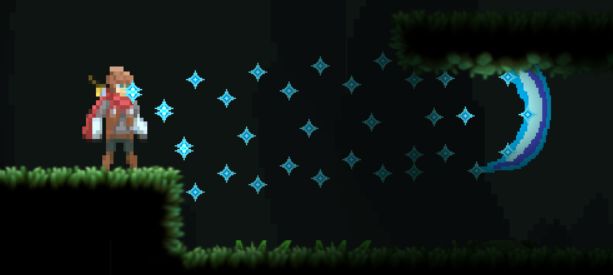
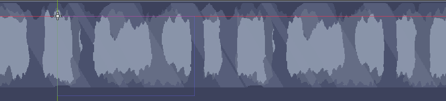

# Cave Runner

Mathieu Mercier

Ce jeux est un plateformer 2d ayant pour but de mettre en avant la liberté de mouveemnt et la méchanique de jeux die and retry. En effet le personnage controller 
par le joueur a des mouvement rapide et agile ayant pour but de donner un sentiment de liberté au joueur dans ses mouvement. en contrepartie, le jeux est sombre 
donc on doi faire attention au obstacles cachées dans les ténèbres qui vont tué en un coup d'ou l'aspect un peut rogue like "die and retry".

## state machine

La state machine est une manière de gérer le code d'un jeux quand il devient plus complexe en compartimenteant selon des states séparer qui s'alterne entre eux en évitant 
le code spaghettie ou la multiplication des if

<table>
    <tr>
        <td>
            <figure>
                
                <figcaption>personnage changeant de state l'annonçceant dans la console</figcaption>
            </figure>
        </td>
    </tr>
</table>
*

## dinamic light 

Le jeux est situé dans une caverne alors il fait surtout noir exepté pour la zone illuminer par le joueur  ou certains éléments du décors grace au noeud canvas modulate et au noeud light2d.

<table>
    <tr>
        <td>
            <figure>
                
                <figcaption>éclairage par le personnage et la flore de la caverne sombre</figcaption>
            </figure>
        </td>
    </tr>
</table>
*
## enemy chase 

Les enemy vont voir ta lumière et te prendre en chase grace a des area 2D détectant ton entrer et ta sortie de la zone de détection.

<table>
    <tr>
        <td>
            <figure>
                
                <figcaption>chauve souris attaque le joueur</figcaption>
            </figure>
        </td>
    </tr>
</table>
*

## walljump

Le player peu s'acrocher au mur en utilisant des raycast pour détecter ceux-ci il pourra alors glisser vers le bas a diverse vitesse ou bien performer un saut murale. 

<table>
    <tr>
        <td>
            <figure>
                
                <figcaption>personnage accrocher au mur s'apprètant a sauté </figcaption>
            </figure>
        </td>
    </tr>
</table>
*
## attack a distance/ système de particule 

Le player peut utiliser une attack a distance sous la forme d'une attack qui laisse une trainé de particule derrière elle grace a l'utilisation de cpu particle un noeud 
intégré a godot qui perment de générer et modifiers des particules

<table>
    <tr>
        <td>
            <figure>
                
                <figcaption>personnage utilisant sont attacque a distance créant ainsi des particules</figcaption>
            </figure>
        </td>
    </tr>
</table>
*
## parralax

Malgré l'éclairage faible de la caverne le paysage au fond reste en mouvement a différente vitesse grace au noued parralax layer de godot qui permet la gestion facile 
de diverse couche de fond'écrans avamçant a diverse vitesses.
<table>
    <tr>
        <td>
            <figure>
                
                <figcaption>fond d'écrans dinamyque a plusieur couche en parralax</figcaption>
            </figure>
        </td>
    </tr>
</table>
*
